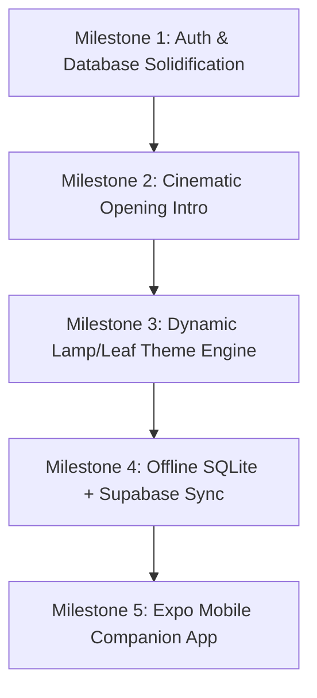

# Clarity — Project Status, Retrospective & Strategic Roadmap
*Generated: September 25, 2026 | Repository: Sahil-XD/Clarity*

> **"Silence the Noise. Master Your Craft."**  
> Clarity is an offline-capable, luxury personal productivity sanctuary (diary, calendar, tasks, expenses, projects) designed for deep focus, tactile satisfaction, and zero recurring subscription fees.

---

## 1. Executive Summary & Core Mission

Clarity was born out of a clear realization: modern productivity tools like **Notion**, **TickTick**, and **Brite** have become bloated, cognitive-heavy, and financially predatory. They bombard the user with endless relational databases, complex toggles, and exorbitant monthly subscriptions just to write down thoughts or track daily chai expenses.

Clarity rejects that paradigm. It is designed as a **digital Bahi Khata (bound ledger folio)**:
- **Zero-Subscription Guarantee (₹0 Budget):** Built entirely on free, open-source, and generous perpetual free tiers (Tauri 2, React, Tailwind, Supabase free tier).
- **Physical Stationery Warmth:** Inspired by physical notebooks, engineering graph paper, cloth spines, and clean ink typography.
- **Complete Privacy & Offline Resilience:** Local-first data access, SHA-256 encrypted PIN protection for personal journals, and seamless cloud synchronization.

---

## 2. What We Did (Accomplishments & Built Features)

Across 32 commits from late August to late September 2026, the application evolved through three architectural iterations into a robust desktop sanctuary:

### A. The Five Core Sanctuaries
1. **Diary & Journal (`DiaryPage.tsx`):**
   - 14-day horizontal history deck with quick-jump calendar navigation.
   - PIN-protected vault with secure SHA-256 Web Crypto hashing (with backward-compatible migration for legacy credentials).
   - Notebook-ruled lines (32px baseline grid) with smooth serif typography (**Newsreader**).
   - Silent 1.5-second auto-save engine with non-blocking inline status indicator (zero audio spam, zero modal interruptions).
   - Mood selector that tracks emotional pacing across the journal entries.
2. **Tasks & Action Items (`TasksPage.tsx`):**
   - High-density list with customized priority tagging (High, Medium, Low).
   - Instant optimistic completion state with tactile checkbox spring physics.
   - Slide-in "New Task" drawer for rapid inscription.
   - Synchronized deletion: Deleting a task in the Tasks page automatically purges corresponding entries from the Calendar feed.
3. **Calendar & Event Folio (`CalendarPage.tsx`):**
   - Dedicated dual-tab architecture: **Tasks View** (month/year grids) vs. **Notes Feed** (continuous vertical scrolling diary feed).
   - GitHub-style 365-day year heatmap visualization aggregating historical activity.
   - Quick date selector and day-wise time blocks.
4. **Expenses & Ruled Ledger (`ExpensesPage.tsx`):**
   - Structured ledger formatting with debit columns and account vouchers.
   - Interactive, customizable monthly budget allocation stored locally.
   - Real-time budget pacing indicator showing current day of month vs. spending velocity.
   - Daily spending averages with division-by-zero protection.
   - Monochrome ink category categorization with clean tabular numerals.
5. **Projects & Craft Dockets (`ProjectsPage.tsx`):**
   - Multi-column Kanban board (TODO, IN PROGRESS, DONE) with stage counting.
   - Color-coded project workspace picker with rapid project switcher.
   - Defensive array guards preventing crashes on freshly initialized projects.

### B. Core Architecture & Infrastructure
- **Tauri 2 + React + TypeScript + Vite:** Ultra-lightweight native desktop binary (~15MB RAM vs 300MB+ for Electron).
- **Direct Supabase Integration:** Replaced heavy local JVM backend with direct `@supabase/supabase-js` client queries.
- **UUID & Snake_Case Migration:** Unified data models on Supabase-native UUIDs (`gen_random_uuid()`) and Postgres standard naming (`due_at`, `start_at`, `event_date`, etc.).
- **Row-Level Security (RLS):** Complete multi-tenant security isolating every record to `auth.uid()`.
- **Sensory Audio Engine (`sound.ts`):** Web Audio API synthesizer generating tactile clicks, pops, and slides without external media assets.
- **Windows Desktop WebView2 Integration:** Customized desktop Chrome `userAgent` in `tauri.conf.json` to prevent Google OAuth blocks.

---

## 3. What We Failed (Honest Post-Mortem of Mistakes & Traps)

Progress is forged through trial and error. Here is the unvarnished account of every technical and design pitfall encountered:

| Failure / Mistake | Root Cause | Consequence | How It Was Solved |
| :--- | :--- | :--- | :--- |
| **1. Spring Boot Over-Engineering** | Chose a heavy enterprise Java backend (Spring Boot 3 + PostgreSQL) for what was essentially a personal desktop app. | Huge memory footprint, required Java/Postgres installation on user's PC, failed Windows MSVC C++ linking during Tauri builds. | Discarded Spring Boot; migrated first to embedded SQLite (`rusqlite`), then to direct Supabase cloud client. |
| **2. Localhost CORS & WebView2 Trap** | Attempted to link a local Spring Boot server with desktop Tauri WebView2 for Google OAuth. | Windows WebView2 strictly blocked CORS requests to `localhost:8080`, trapping auth tokens. | Ditched local HTTP bridges in favor of direct Supabase SDK calls with native browser redirect handling. |
| **3. Premature OAuth Testing** | Tried logging into Google OAuth without verifying provider state in the Supabase Dashboard. | Supabase returned `400 validation_failed: Unsupported provider: provider is not enabled`. | Probed the live Supabase API, identified that the Google toggle was OFF, and documented exact dashboard steps for the user. |
| **4. Google 403 `disallowed_useragent`** | Default Windows WebView2 user agent was rejected by Google Identity Services. | Google blocked login attempts with security error dialogs. | Added a desktop Chrome `userAgent` string to `tauri.conf.json`'s window configuration. |
| **5. Claude Code Refactor Regressions** | A 1,700-line automated refactor changed IDs to UUIDs but missed critical runtime edge cases. | - Project Kanban crashed (`TypeError: prev[id].map is not a function`). - Diary auto-save played audio click every 1.5s. - Diary threw intrusive browser `alert()` on network latency. - Diary PIN was saved in plaintext. - Budget pacing crashed on Day 0 or zero budget. | Audited the entire diff, injected defensive fallbacks `(prev[id] || [])`, silenced auto-save audio, implemented Web Crypto SHA-256 hashing, and added `safeBudget`/`safeDays` guards. |
| **6. Visual Noise & Palette Overload** | Every tab had a different saturated pastel color (sage, rose, honey, sky) stacked on graph paper and clay bevels. | Visual exhaustion after 30 minutes of use; felt like a template rather than an executive sanctuary. | Adopted the **Ruled Ledger (Bahi Khata)** philosophy: disciplined blue-black ink, vermilion accents, and tabular rules. |
| **7. Sanitizing User's Stylized Copy** | AI models repeatedly tried to replace bahi khata stationery copy with generic SaaS text. | Diluted the unique personality and stationery feel of Clarity. | Restored and permanently locked user-chosen terminology (*"Inscribe Task"*, *"Project Dockets"*, *"Ruled personal expenditure & budget pacing"*). |

---

## 4. What Is Lacking (Current Gaps & Shortcomings)

While the desktop application compiles with 0 errors and all core pages function, several key elements remain incomplete:

1. **Google OAuth Activation in Supabase:**
   - The desktop app code is 100% prepared, but the Google provider toggle remains switched OFF in the Supabase dashboard (`rbhtqvysfkxhcsmvejws`).
   - Requires Google Cloud OAuth Client ID and Secret to be saved in Supabase Auth Settings.
2. **Supabase Profile Trigger Execution:**
   - When new users register via Supabase Auth, a corresponding row in the `public.profiles` table must be created automatically.
   - The SQL script [`docs/supabase-profile-trigger.sql`](file:///C:/Clarity/docs/supabase-profile-trigger.sql) is prepared but must be run once in the Supabase SQL Editor.
3. **Bi-Directional Cloud/Offline Sync Engine:**
   - Currently, the app speaks directly to Supabase when online. If completely offline, it falls back to local storage and session caching.
   - A true hybrid sync engine (local SQLite as primary cache + background delta sync to Supabase with conflict resolution) is planned in Rust/TypeScript.
4. **Cinematic Opening Display (`masterplan.md`):**
   - The opening brand reveal (vector path laser tracing of the Clarity logo, ignition bloom, and manifesto fade) is designed in theory but not yet built.
5. **Dark Mode ("Lamp Theme") Dynamic Switcher:**
   - The design tokens for Lamp (dark blue-black `#121519`) and Leaf (daylight `#E3E0D6`) are documented in `opus5.md`, but dynamic runtime switching via CSS variables or a UI toggle button is not yet wired across all pages.
6. **Mobile Companion (Expo React Native):**
   - Mobile repository has not yet been initialized.

---

## 5. Our Next Plan (Step-by-Step Strategic Roadmap)

### Milestone 1: Auth & Database Solidification
- **Step 1:** User enables Google OAuth in Supabase Dashboard (`Auth > Providers > Google`) and pastes Google Cloud Web Credentials.
- **Step 2:** User runs [`docs/supabase-profile-trigger.sql`](file:///C:/Clarity/docs/supabase-profile-trigger.sql) in Supabase SQL Editor.
- **Step 3:** Verify end-to-end Google login and profile auto-generation in the desktop app.

### Milestone 2: Cinematic Opening Display (Per `masterplan.md`)
- **Protocol:** Strict isolated sandbox rule—never inject animation code directly into production components until visually validated.
- **Step 1:** Build an isolated `<CinematicIntro />` component in a standalone test page.
- **Step 2:** Implement 5-phase sequence: Pitch Void -> Vector Laser Tracing -> Bloom -> Manifesto -> Dissolve.
- **Step 3:** Add session guard (`sessionStorage.getItem('clarity_intro_seen')`) and instant skip key handlers (`Escape` / `Space`).
- **Step 4:** Mount onto `App.tsx`.

### Milestone 3: Dynamic Lamp/Leaf Design System
- **Step 1:** Consolidate color variables in `styles.css` using `:root` (Lamp dark) and `[data-theme="leaf"]` (Daylight).
- **Step 2:** Add theme toggle icon (Sun/Moon) to the bottom-left sidebar next to the mute button.
- **Step 3:** Implement the signature **Notebook Volumes** counter (`Notebook Vol. I — 168 of 200 pages`) dynamically bound to actual diary entry count.

### Milestone 4: Hybrid Offline/Cloud Sync Engine
- **Step 1:** Utilize Rust SQLite as the persistent offline local data layer in Tauri.
- **Step 2:** Implement a background sync daemon that pushes dirty records (UUID, `updated_at`, `deleted_at`) to Supabase when online.
- **Step 3:** Implement Last-Write-Wins pull sync to pull remote updates down to SQLite.

### Milestone 5: Expo React Native Mobile Companion
- **Step 1:** Initialize an Expo React Native TypeScript project in `mobile/`.
- **Step 2:** Share core models, Supabase client, and design tokens with desktop.
- **Step 3:** Implement mobile diary quick-capture, task widgets, and expense loggers for on-the-go tracking.
