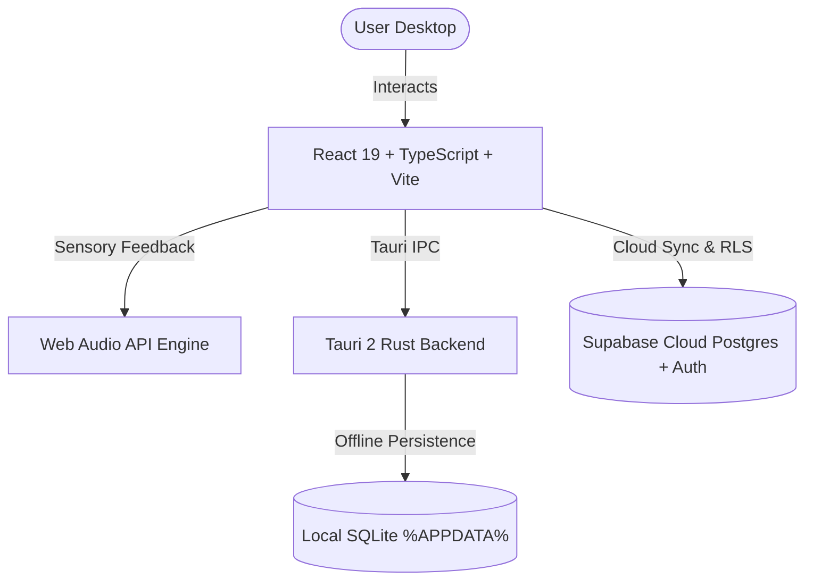

# Clarity ✦

> **Silence the Noise. Master Your Craft.**  
> An offline-capable, luxury personal productivity sanctuary designed for deep focus, tactile satisfaction, and a strict **₹0 recurring budget**.

[](LICENSE)
[](https://v2.tauri.app/)
[](https://react.dev/)
[-3ecf8e.svg)](https://supabase.com/)
[-dea584.svg)](https://www.rust-lang.org/)

---

## ✦ Why Clarity?

Modern tools like **Notion**, **TickTick**, and **Brite** have become bloated, cognitive-heavy, and financially predatory. They bombard users with complex relational databases, infinite nested toggles, and expensive monthly subscriptions just to jot down daily reflections or track everyday expenses.

**Clarity takes the opposite approach.** It is designed as a digital **Bahi Khata (bound ledger folio)**:
* **Strict ₹0 Budget:** Completely free and open-source, leveraging generous perpetual free tiers (Tauri, React, Supabase).
* **Physical Stationery Warmth:** Inspired by cloth-bound notebooks, engineering graph paper, clean ruling lines, and Newsreader serif typography.
* **Complete Privacy & Local Resilience:** Local-first offline access, SHA-256 encrypted PIN vault for personal reflections, and seamless cloud synchronization.

---

## ✦ Core Sanctuaries

| Sanctuary | Description | Key Capabilities |
| :--- | :--- | :--- |
| **📔 Diary & Journal** | Private, reflective writing sanctuary | SHA-256 PIN security, 14-day history deck, silent 1.5s auto-save, mood pacing, notebook-ruled lines. |
| **📅 Calendar & Folio** | Unified temporal overview | Dual-tab architecture (Tasks vs. Notes Feed), 365-day GitHub-style year heatmap, daily time blocks. |
| **☑️ Tasks & Actions** | Focused to-do docket | Instant optimistic completion, priority badges, synchronized deletion with Calendar events. |
| **💳 Ruled Ledger** | Personal expense tracking | Account vouchers, customizable monthly budget pacing, daily averages, zero-division protection. |
| **📁 Craft Dockets** | Visual initiative tracking | Multi-column Kanban board (TODO / IN PROGRESS / DONE), custom workspace color tagging. |

---

## ✦ Design Philosophy: The Ruled Ledger (Bahi Khata)

Clarity is not a pastel mood board—it is an executive personal ledger:
* **Disciplined Palette:** Blue-black ink (`#121519`), leaf ground (`#1A1E24`), and vermilion rules (`#E2604F`) reserved strictly for primary actions.
* **Typography:** Editorial serif (**Newsreader**) for reading long-form thoughts; modern geometric sans (**Plus Jakarta Sans**) for clean interface chrome; tabular monospace for aligned financial figures.
* **Tactile Sensory Audio:** In-house synthesized clicks, pops, and slides powered by the Web Audio API without bulky audio assets.
* **Volume Milestones:** Designed around *Notebook Volumes* (e.g., Vol. I closes after 200 entries, generating a summary spread before opening Vol. II).

---

## ✦ System Architecture



* **Frontend:** React 19, TypeScript, Vite, TailwindCSS, Lucide Icons.
* **Desktop Shell:** Tauri 2 (Rust), consuming ~15MB RAM (vs. 300MB+ for Electron).
* **Cloud & Auth:** Supabase (PostgreSQL with Row-Level Security, Auth, Storage).
* **Offline Storage:** Embedded SQLite via Rust `rusqlite`.

---

## ✦ Getting Started

### Prerequisites
* [Node.js](https://nodejs.org/) (v20+ recommended)
* [Rust](https://rustup.rs/) (v1.75+ for Tauri 2)
* [C++ Build Tools](https://visualstudio.microsoft.com/visual-cpp-build-tools/) (MSVC on Windows)

### 1. Clone & Install
```bash
git clone https://github.com/Sahil-XD/Clarity.git
cd Clarity/desktop
npm install
```

### 2. Environment Configuration
Create a `.env` file in the `desktop/` directory:
```env
VITE_SUPABASE_URL=https://<your-project-id>.supabase.co
VITE_SUPABASE_ANON_KEY=<your-anon-key>
```

### 3. Run in Development Mode
```bash
# Web-only dev server (instant browser preview)
npm run dev

# Native Tauri Desktop App (hot-reloading native window)
npm run tauri dev
```

### 4. Build Production Executable
```bash
npm run tauri build
```
The compiled, standalone installer and executable will be generated in `desktop/src-tauri/target/release/bundle/`.

---

## ✦ Database & Cloud Setup (Supabase)

Clarity includes pre-configured SQL migration scripts in the [`docs/`](docs/) directory:
1. **Schema Definition:** Run [`docs/supabase-schema.sql`](docs/supabase-schema.sql) in the Supabase SQL Editor to create tables for profiles, tasks, diary entries, calendar events, expenses, and projects.
2. **Row-Level Security:** Run [`docs/supabase-rls.sql`](docs/supabase-rls.sql) to enforce strict user data isolation scoped to `auth.uid()`.
3. **Profile Trigger:** Run [`docs/supabase-profile-trigger.sql`](docs/supabase-profile-trigger.sql) to automatically provision profile records upon user registration.

---

## ✦ Project Documentation & Chronicles

* 📋 [Project Status, Retrospective & Strategic Roadmap](PROJECT_STATUS_AUDIT_AND_ROADMAP.md) — Comprehensive breakdown of what was built, failures/post-mortem, gaps, and roadmap.
* 📜 [Commit Progression Journey & Chronicles](COMMIT_PROGRESSION_JOURNEY.md) — 35-commit deep dive exploring the chronological evolution from inception to current production state.
* 🎬 [Cinematic Opening & Aesthetic Master Plan](masterplan.md) — Storyboard and technical specification for the Awwwards-tier opening experience.
* 🎨 [Sensory Upgrade & Micro-Interactions Catalog](upgrade-ui.md) — Catalog of kinetic interactions, page curl physics, and mechanical counter tickers.
* 🤖 [Claude Code Refactor Session Log](claude-code.md) — Historical log of the Phase 3 UUID migration session.

---

## ✦ License

This project is licensed under the **MIT License** — open-source and free forever.
