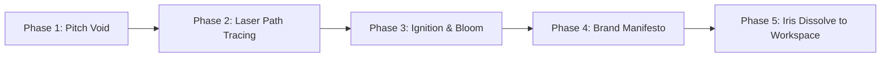

# Master Plan: Cinematic Opening & Luxury Aesthetic Protocol

> **Objective:** Elevate Clarity to an Awwwards-tier, luxury digital experience (inspired by studios like Utsubo and the Rolls-Royce web experience) on a strict **₹0 budget**, while completely safeguarding existing app logic from visual regressions.

---

## 1. The Core Philosophy: Why Luxury Sites Hit Different

Ordinary web and desktop apps look cheap because they try to animate regular `
` tags with generic CSS transitions (`ease-in-out`, `0.3s opacity/translate`). This causes layout thrashing, jitter, and destroys complex components (like calendars and dense grids).

Studios behind **Utsubo**, **Rolls-Royce**, and **Apple** use a fundamentally different formula:

1. **GPU-Accelerated Layers over DOM Layouts:** 
   Cinematic moments run on isolated SVG vector paths, Canvas 2D, or WebGL shaders. The browser calculates zero layout shifts, maintaining a locked 60/120 FPS.
2. **Spring Physics & Heavy Easing over Generic Curves:** 
   Luxury brands never use standard browser easing. They use custom cubic-beziers with heavy deceleration (`cubic-bezier(0.16, 1, 0.3, 1)` or `[0.22, 1, 0.36, 1]`) or exact physical spring parameters (`damping: 25, mass: 1.2, stiffness: 120`).
3. **Isolated Hero Sequences:** 
   The cinematic hero sequence is an independent stage. It never interferes with functional grids, databases, or inputs.

---

## 2. AI Model & Tooling Strategy (Strict ₹0 Budget)

| Option | Verdict | Why |
| :--- | :--- | :--- |
| **Gemini 3.1 Pro (Context Dump)** | **SELECTED (₹0)** | **1M–2M token context.** Ingests entire animation libraries, GSAP guides, Three.js shader code, SVG geometry, and physics models in a single prompt without forgetting anything. |
| **Opus 4.6 + OmniRoute (4 Accounts)** | **REJECTED** | High friction, session dropping, proxy latency. Furthermore, raw model size does not equal taste—without exact math curves and SVG paths, even Opus produces generic fades. |
| **GLM 5.3 Flash** | **REJECTED** | Built for fast inference and summarization, not spatial canvas rendering or high-end kinetic choreographies. Waste of money. |

---

## 3. The Isolated Sandbox Protocol (Zero-Risk Rule)

### The Golden Rule:
> **"Never write animation code directly into the production codebase until it is 100% visually verified in an isolated playground."**

### Workflow:
1. **The Sandbox:** Work in an isolated sandbox directory (`Clarity-Lab` or a standalone Vite/HTML preview).
2. **Context Prime:** Feed the dedicated chat the exact SVG paths of the Clarity logo, design tokens, and physics formulas.
3. **Browser Verification:** Run the sequence standalone in a browser window. Inspect 120Hz frame rates, motion blur, and color grading.
4. **Clean Merge:** Only once approved, bring the sequence over as a single, self-contained `<CinematicIntro />` component into Clarity.

---

## 4. The 5-Phase Cinematic Opening Sequence

### Phase 1: The Pitch Void (0.0s – 0.6s)
* **Visual:** Absolute matte black/deep obsidian background (`#05070a`).
* **Atmosphere:** An ultra-subtle ambient specular radial beacon at the center, setting the stage without clutter.
* **Audio Cue:** Sub-bass rumble / low-frequency pulse (optional / subtle).

### Phase 2: Vector Laser Path Tracing (0.6s – 1.8s)
* **Visual:** The Clarity 'C' logo and inner diamond facets are drawn using mathematical vector line tracing (`stroke-dasharray` / `stroke-dashoffset` interpolation).
* **Styling:** Ultra-fine 1.5px stroke with a glowing cyan/ice-blue neon comet leading the stroke path.
* **Physics:** Decelerating luxury curve: `cubic-bezier(0.25, 1, 0.5, 1)`.

### Phase 3: Ignition & Specular Bloom (1.8s – 2.4s)
* **Visual:** The moment the vector loop closes, an intense high-exposure flash/bloom sparks at the focal vertex.
* **Effect:** Radial light rays scatter outward; faceted glass refractions illuminate the inner core of the Clarity emblem.
* **Transition:** The thin stroke fills smoothly into a metallic/glassmorphic finished emblem.

### Phase 4: Typographic Manifesto Reveal (2.4s – 3.6s)
* **Visual:** Clean, modern geometric typography emerges beneath the mark.
* **Motion:** Staggered character reveal with vertical clip-path unmasking (`translateY: 20px -> 0px`, blur: `8px -> 0px`).
* **Text:**
  > **CLARITY**  
  > *Silence the Noise. Master Your Craft.*

### Phase 5: Cinematic Iris Dissolve (3.6s – 4.2s)
* **Visual:** The logo smoothly scales up with slight depth-of-field blur as an iris mask expands outward to seamlessly reveal the user's dashboard/workspace.
* **Zero UI Disruption:** The underlying dashboard is already pre-mounted underneath; no re-render, zero layout flicker.

---

## 5. Non-Negotiable UX Guarantees

1. **First-Launch / Cold-Boot Only:** 
   Guarded by `sessionStorage.getItem('clarity_intro_seen')`. It will not replay on every internal page route change.
2. **Instant Skip Mechanism:** 
   Pressing `ESC`, `Space`, or clicking anywhere instantly fades the intro out (`200ms` dissolve) directly into the workspace.
3. **Zero App State Dependencies:** 
   The intro is pure presentation. If local SQLite or cloud Supabase sync takes 500ms to initialize in the background, the intro conceals the cold-start delay naturally.

---

*Document created: 2026-09-24*  
*Protocol: Pure Visual Excellence | Strict ₹0 Budget | Zero Code Regressions*
