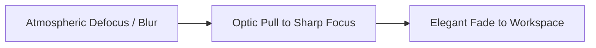

# Master Plan: Cinematic Opening & Luxury Aesthetic Protocol

> **Objective:** Elevate Clarity to an Awwwards-tier, luxury digital experience (inspired by studios like Utsubo and the Rolls-Royce web experience) on a strict **₹0 budget**, while completely safeguarding existing app logic from visual regressions.

---

## 1. The Core Philosophy: Why Luxury Sites Hit Different

Ordinary web and desktop apps look cheap because they try to animate regular `
` tags with generic CSS transitions (`ease-in-out`, `0.3s opacity/translate`). This causes layout thrashing, jitter, and destroys complex components (like calendars and dense grids).

Studios behind **Utsubo**, **Rolls-Royce**, and **Apple** use a fundamentally different formula:

1. **GPU-Accelerated Layers over DOM Layouts:** 
   Cinematic moments run on isolated SVG vector paths, Canvas 2D, or WebGL shaders. The browser calculates zero layout shifts, maintaining a locked 60/120 FPS.
2. **Spring Physics & Heavy Easing over Generic Curves:** 
   Luxury brands never use standard browser easing. They use custom cubic-beziers with heavy deceleration (`cubic-bezier(0.16, 1, 0.3, 1)` or `[0.22, 1, 0.36, 1]`) or exact physical spring parameters (`damping: 25, mass: 1.2, stiffness: 120`).
3. **Isolated Hero Sequences:** 
   The cinematic hero sequence is an independent stage. It never interferes with functional grids, databases, or inputs.

---

## 2. AI Model & Tooling Strategy (Strict ₹0 Budget)

| Option | Verdict | Why |
| :--- | :--- | :--- |
| **Gemini 3.1 Pro (Context Dump)** | **SELECTED (₹0)** | **1M–2M token context.** Ingests entire animation libraries, GSAP guides, Three.js shader code, SVG geometry, and physics models in a single prompt without forgetting anything. |
| **Opus 4.6 + OmniRoute (4 Accounts)** | **REJECTED** | High friction, session dropping, proxy latency. Furthermore, raw model size does not equal taste—without exact math curves and SVG paths, even Opus produces generic fades. |
| **GLM 5.3 Flash** | **REJECTED** | Built for fast inference and summarization, not spatial canvas rendering or high-end kinetic choreographies. Waste of money. |

---

## 3. The Isolated Sandbox Protocol (Zero-Risk Rule)

### The Golden Rule:
> **"Never write animation code directly into the production codebase until it is 100% visually verified in an isolated playground."**

### Workflow:
1. **The Sandbox:** Work in an isolated sandbox directory (`Clarity-Lab` or a standalone Vite/HTML preview).
2. **Context Prime:** Feed the dedicated chat the exact SVG paths of the Clarity logo, design tokens, and physics formulas.
3. **Browser Verification:** Run the sequence standalone in a browser window. Inspect 120Hz frame rates, motion blur, and color grading.
4. **Clean Merge:** Only once approved, bring the sequence over as a single, self-contained `<CinematicIntro />` component into Clarity.

---

## 4. The Cinematic Opening Sequence (Optic Focus Pull: Blurry to Visible)

> **Core Concept:** A clean, minimalist focus pull that visually embodies the very concept of *Clarity*. No long mottos, no multi-phase speeches—just the **Emblem + Name "Clarity"** snapping from deep atmospheric lens blur into crisp, crystalline focus.

```mermaid
graph LR
    A[Atmospheric Defocus / Blur] --> B[Optic Pull to Sharp Focus] --> C[Elegant Fade to Workspace]
```

### Stage 1: The Deep Lens Blur (0.0s – 0.8s)
* **Visual:** Clean warm background matching the default light palette (`#E3E0D6` / `#F2F0E8`).
* **Optics:** The Clarity emblem and typography are submerged in a heavy optical depth-of-field blur (`filter: blur(28px)`, scale: `0.94`, opacity: `0.2`).
* **Concept:** Represents mental noise, chaos, and unfocused thoughts before entering the app.

### Stage 2: The Focus Pull to Razor Sharpness (0.8s – 2.0s)
* **Optics:** The camera focal plane rapidly and smoothly pulls forward with heavy luxury spring easing (`stiffness: 140, damping: 24`):
  * Blur resolves continuously: `28px -> 0px`.
  * Scale breathes forward: `0.94 -> 1.0`.
  * Opacity locks to full: `1.0`.
* **Visual Elements:**
  * **The Clarity Emblem:** High-precision geometric facets snap into razor-sharp lines.
  * **The Wordmark:** **Clarity** in crisp serif/geometric typography with subtle tracking expansion (`letter-spacing: 0.22em -> 0.12em`).
  * Pure simplicity: **Just Logo + Name "Clarity"** (no mottos or extra text).

### Stage 3: Seamless Dissolve into Workspace (2.0s – 2.5s)
* **Visual:** The emblem and wordmark soften and fade out (`opacity: 1 -> 0`, slight upward drift `translateY: -8px`), revealing the pre-mounted light theme dashboard underneath.
* **Zero UI Disruption:** Instant, zero-layout-shift transition.

---

## 5. Non-Negotiable UX Guarantees

1. **First-Launch / Cold-Boot Only:** 
   Guarded by `sessionStorage.getItem('clarity_intro_seen')`. It will not replay on every internal page route change.
2. **Instant Skip Mechanism:** 
   Pressing `ESC`, `Space`, or clicking anywhere instantly fades the intro out (`200ms` dissolve) directly into the workspace.
3. **Zero App State Dependencies:** 
   The intro is pure presentation. If local SQLite or cloud Supabase sync takes 500ms to initialize in the background, the intro conceals the cold-start delay naturally.

---

*Document created: 2026-09-24*  
*Protocol: Pure Visual Excellence | Strict ₹0 Budget | Zero Code Regressions*
